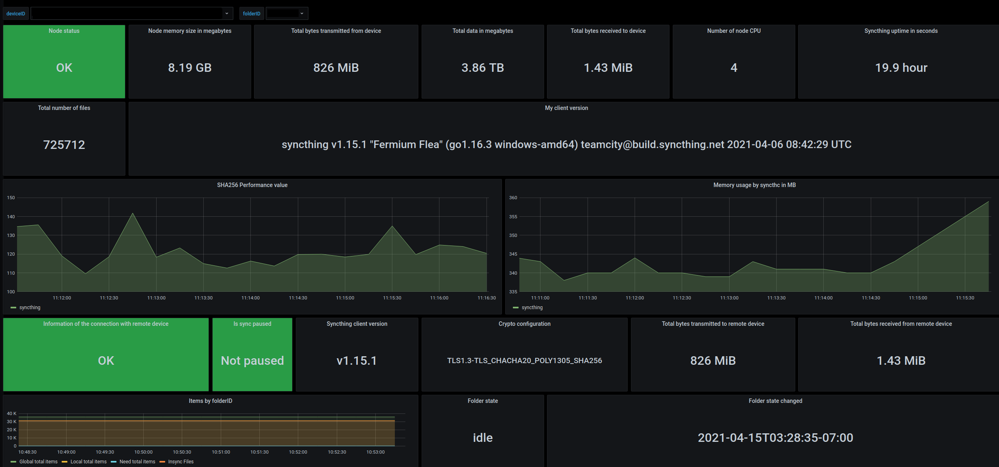

# Syncthing exporter

### Build and run exporter

Clone current repository and 
```bash

cd syncthing_exporter
go build .

./syncthing_exporter --version
```

For pre-built binaries please take a look at the releases.

Basic prometheus configuration:

```yaml
  - job_name: 'syncting_server'
    metrics_path: /metrics
    static_configs:
      - targets: ['127.0.0.1:9093']
        labels:
          service: syncthing_server
```

### Start flags

Name                | Evironment variable | Required | Description
--------------------|---------------------|----------|-------------
web.listen-address  | WEB_LISTEN_ADDRESS  |     -    | Address ot listen on for web interface and telemetry  
web.metrics-path    | WEB_METRIC_PATH     |     -    | Path under which to expose metrics  
syncthing.uri       | SYNCTHING_URI       |     +    | HTTP API address of Syncthing node  
syncthing.token     | SYNCTHING_TOKEN     |     +    | Token for authentification Syncthing HTTP API
syncthing.timeout   | SYNCTHING_TIMEOUT   |     -    | Timeout for trying to get stats from Syncthing
syncthing.foldersid | SYNCTHING_FOLDERSID |     -    | List of ids of folders, delimeter is ','

### What's and how exported

Example of all metrics related to `syncthing` [here](examples/exposed_parameters.md).

For data obtaining is using two endpoints:

[GET /rest/svc/report](https://docs.syncthing.net/rest/svc-report-get.html)  
[GET /rest/system/connections](https://docs.syncthing.net/rest/system-connections-get.html)  
[GET /rest/stats/device](https://docs.syncthing.net/rest/stats-device-get.html)  
[GET /rest/db/status](https://docs.syncthing.net/rest/db-status-get.html)*  

>\* This is an expensive call, increasing CPU and RAM usage on the device. Use sparingly.

### Grafana dashboard

Example of grafana dashboard:




## Docker support
How to run
```
docker run -it -e "SYNCTHING_URI=http://127.0.0.1:8384/" -e SYNCTHING_TOKEN="super-secure-token" f100024/syncthing_exporter:latest
```

docker-compose example:
```
  syncthing_exporter:
    image: f100024/syncthing_exporter:latest
    ports:
      - 9093:9093
    environment:
      SYNCTHING_URI: "http://127.0.0.1:8384/"
      SYNCTHING_TOKEN: "super-secure-token"
    restart: unless-stopped
```


## Communal effort
Any ideas and pull requests are appreciated.
